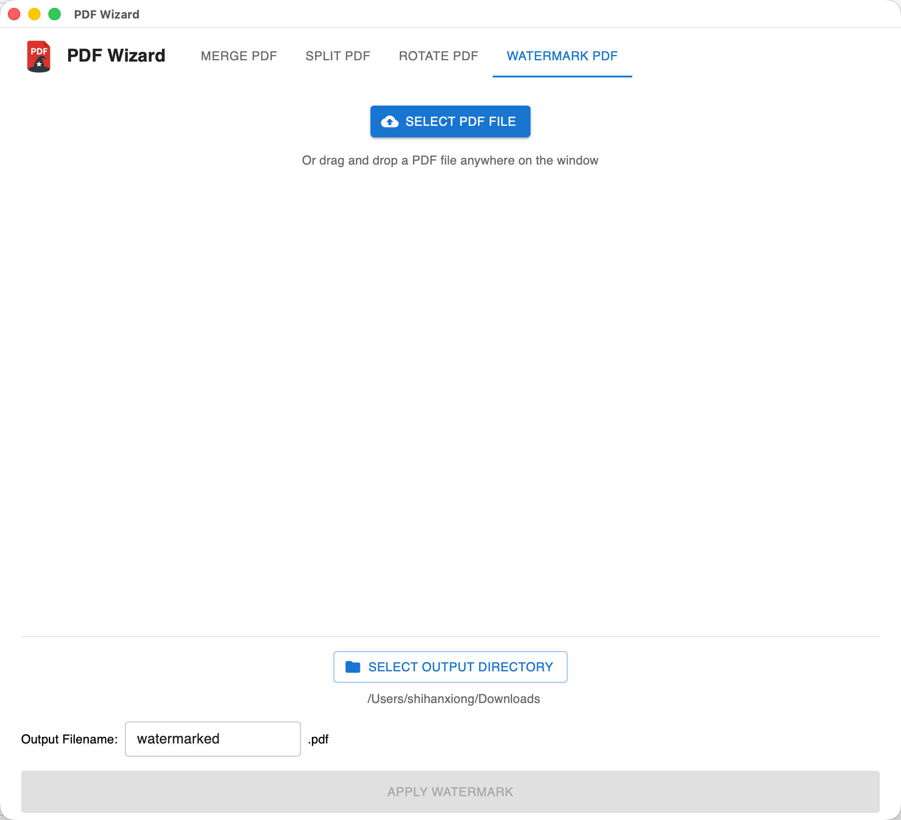

# PDF Wizard

<p align="center">
  
</p>

A modern PDF toolkit built with [Wails v2](https://wails.io), combining Go backend performance with a React/TypeScript frontend. PDF Wizard provides four main features:

- **Merge PDFs**: Combine multiple PDF files into a single document
- **Split PDFs**: Divide a PDF into multiple files based on page ranges
- **Rotate PDFs**: Rotate specific page ranges in a PDF (90°, -90°, or 180°)
- **Watermark PDFs**: Add text watermarks to PDFs with customizable font, size, color, opacity, rotation, and position. Features **language-specific fonts** that automatically adapt based on your selected language (Chinese, Japanese, Korean, Hindi, and standard fonts for other languages)

**Features:**

- 🌍 **Internationalization**: Supports 12 languages (English, Chinese Simplified, Chinese Traditional, Arabic, French, Japanese, Hindi, Spanish, Portuguese, Russian, Korean, German) with easy language switching
- 🎨 **Modern UI**: Built with Material-UI for a polished, responsive interface
- 🖱️ **Drag & Drop**: Intuitive file handling with drag-and-drop support
- ⚡ **Fast Performance**: Native Go backend ensures quick PDF processing

## Screenshots

### Merge PDF Tab

<p align="center">
  
</p>

### Split PDF Tab

<p align="center">
  
</p>

### Rotate PDF Tab

<p align="center">
  
</p>

### Watermark PDF Tab

<p align="center">
  
</p>

## Downloads

Pre-built installers are available in the [`pdf_wizard/dist/`](https://github.com/shihanxiong/PDF_Wizard/tree/master/pdf_wizard/dist) folder.

### macOS

- **DMG Installer**: [`pdf_wizard-macos-universal.dmg`](https://github.com/shihanxiong/PDF_Wizard/raw/master/pdf_wizard/dist/pdf_wizard-macos-universal.dmg) - Universal binary for both Intel and Apple Silicon Macs
- **ZIP Archive**: [`pdf_wizard-macos-universal.zip`](https://github.com/shihanxiong/PDF_Wizard/raw/master/pdf_wizard/dist/pdf_wizard-macos-universal.zip) - ZIP file containing the application bundle

**macOS Installation Instructions:**

**DMG Installation (Recommended):**

1. Download the DMG file from the [dist folder](https://github.com/shihanxiong/PDF_Wizard/tree/master/pdf_wizard/dist)
2. Double-click the DMG file to mount it
3. Drag `PDF Wizard.app` to the Applications folder (shown in the DMG window)
4. Open Applications folder and launch PDF Wizard
5. On first launch: Right-click → Open → Click "Open" to bypass macOS security warning

**ZIP Installation:**

1. Download the ZIP file from the [dist folder](https://github.com/shihanxiong/PDF_Wizard/tree/master/pdf_wizard/dist)
2. Extract the ZIP file
3. Right-click `PDF Wizard.app` → Open → Click "Open"
4. Or run in Terminal: `xattr -cr "PDF Wizard.app"`

**macOS System Requirements:**

- macOS 10.13 or later
- Works on Intel and Apple Silicon Macs (universal binary)

> **Note**: If you see "App is damaged and can't be opened", right-click the app → Open → Click "Open", or run `xattr -cr "PDF Wizard.app"` in Terminal.

### Windows

- **Standalone Executable**: [`pdf_wizard-windows.exe`](https://github.com/shihanxiong/PDF_Wizard/raw/master/pdf_wizard/dist/pdf_wizard-windows.exe) - Portable executable, no installation required
- **Installer** (optional): [`pdf_wizard-windows-installer.exe`](https://github.com/shihanxiong/PDF_Wizard/raw/master/pdf_wizard/dist/pdf_wizard-windows-installer.exe) - NSIS installer for easy installation (only created if NSIS is installed)
- **Portable ZIP**: [`pdf_wizard-windows-portable.zip`](https://github.com/shihanxiong/PDF_Wizard/raw/master/pdf_wizard/dist/pdf_wizard-windows-portable.zip) - ZIP archive containing the executable

**Windows Installation Instructions:**

**Standalone Executable (Recommended for Quick Start):**

1. Download `pdf_wizard-windows.exe` from the [dist folder](https://github.com/shihanxiong/PDF_Wizard/tree/master/pdf_wizard/dist)
2. Double-click `pdf_wizard-windows.exe` to run
3. No installation required - it's portable!

**Installer** (optional, requires NSIS to be installed during build):

1. Download the installer from the [dist folder](https://github.com/shihanxiong/PDF_Wizard/tree/master/pdf_wizard/dist)
2. Double-click `pdf_wizard-windows-installer.exe`
3. Follow the installation wizard
4. Launch PDF Wizard from the Start menu or desktop shortcut

> **Note**: The installer is only created if NSIS (Nullsoft Scriptable Installer System) is installed on the build machine. If you don't see this file, use the standalone executable or ZIP archive instead.

**Portable ZIP:**

1. Download the ZIP file from the [dist folder](https://github.com/shihanxiong/PDF_Wizard/tree/master/pdf_wizard/dist)
2. Extract the ZIP file to a folder of your choice
3. Double-click `PDF Wizard.exe` to run
4. No installation required - it's portable!

**Windows System Requirements:**

- Windows 10 or later
- Works on both 32-bit and 64-bit Windows

> **Note**: If Windows Defender or SmartScreen blocks the app, click "More info" → "Run anyway". The app is safe - it's just not code-signed.

## Prerequisites

- **Go 1.24.0** (specified in `go.mod`)
- **Node.js 22.21.1** (required by the project)
- **Wails CLI v2.11.0** (matches `github.com/wailsapp/wails/v2 v2.11.0` in `go.mod`)

## Quick Start

### Automated Installation

Run the installation script to set up all dependencies:

```bash
./install.sh
```

This script will:

- Check and install Go (if needed)
- Install Wails CLI
- Verify Node.js and npm are available
- Install frontend dependencies

### Manual Installation

If you prefer to install dependencies manually:

1. **Install Go**: Follow the [official Go installation guide](https://go.dev/doc/install)

2. **Install Wails CLI**:

   ```bash
   go install github.com/wailsapp/wails/v2/cmd/wails@latest
   ```

3. **Verify Node.js**: Ensure Node.js 22.21.1 is installed:
   ```bash
   node --version  # Should show v22.21.1
   npm --version
   ```

## Development

For development instructions, see [pdf_wizard/README.md](pdf_wizard/README.md).

## Building

### Build Executables

Build platform-specific executables:

```bash
cd pdf_wizard
wails build
```

The output will be generated in the `pdf_wizard/build/bin` directory.

**Build for macOS Distribution:**

To create a universal binary that works on both Intel and Apple Silicon Macs:

```bash
cd pdf_wizard
wails build -platform darwin/universal
```

For distribution to other Mac machines, see [Distribution Guide](pdf_wizard/DISTRIBUTION.md).

**Build for Windows Distribution:**

To create a Windows executable:

```bash
cd pdf_wizard
wails build
```

This will create in `build/bin`:

- `PDF Wizard.exe` - Standalone executable
- `PDF Wizard Installer.exe` - NSIS installer (if NSIS is installed)

For distribution packages in the `dist` directory, use the build script:

```bash
cd pdf_wizard
./build-dist.sh
```

This will create in `dist`:

- `pdf_wizard-windows.exe` - Standalone executable (matches macOS naming convention)
- `pdf_wizard-windows-installer.exe` - NSIS installer (only if NSIS is installed on the build machine)
- `pdf_wizard-windows-portable.zip` - ZIP archive containing the executable

> **Note**: To create the NSIS installer, you need to install NSIS first:
>
> - Download from: https://nsis.sourceforge.io/Download
> - Or install via Chocolatey (as Administrator): `choco install nsis`
> - After installing NSIS, rebuild the project to generate the installer

**Quick Distribution Build:**

Use the automated build script (cross-platform):

**On macOS/Linux:**

```bash
cd pdf_wizard
./build-dist.sh
```

**On Windows (PowerShell):**

```powershell
cd pdf_wizard
.\build-dist.ps1
```

**On Windows (Git Bash/WSL):**

```bash
cd pdf_wizard
./build-dist.sh
```

The script automatically detects your operating system and creates:

- **macOS**: DMG installer and ZIP archive
- **Windows**: NSIS installer (if NSIS is installed) and portable ZIP archive

All distribution files are created in the `pdf_wizard/dist` directory.

## Testing

PDF Wizard includes both backend integration tests and frontend E2E tests.

### Backend Integration Tests

Run the Go integration tests locally:

```bash
cd pdf_wizard
go test -v ./...
```

This will run all tests with verbose output.

**Test Coverage:**

To see test coverage:

```bash
cd pdf_wizard
go test -v -coverprofile=coverage.out ./...
go tool cover -func=coverage.out
```

To view an HTML coverage report:

```bash
go tool cover -html=coverage.out
```

**Run Specific Tests:**

Run a specific test function:

```bash
cd pdf_wizard
go test -v -run TestGetFileMetadata
```

Run language management tests:

```bash
cd pdf_wizard
go test -v -run "TestGetLanguage|TestSetLanguage"
```

Run tests with race detection:

```bash
cd pdf_wizard
go test -v -race ./...
```

**Backend Test Coverage:**

The backend test suite includes:

- PDF file operations (merge, split, rotate)
- File metadata retrieval
- Page count operations
- Error handling and validation
- **Language management**:
  - Language preference storage and retrieval
  - Config file handling
  - Default language fallback
  - Invalid config handling

### Frontend E2E Tests

The frontend uses Playwright for end-to-end UI testing. These tests verify the application UI, user interactions, and component behavior.

**Running Tests Locally:**

```bash
cd pdf_wizard/frontend
npm run test:e2e
```

For detailed E2E testing instructions, test structure, configuration, and CI/CD setup, see the [E2E Testing README](pdf_wizard/frontend/e2e/README.md).

## Features

### Watermark PDFs

The watermark feature includes intelligent font selection based on your application language. Font options automatically filter to show only fonts appropriate for your selected language (Chinese, Japanese, Korean, Hindi, and standard fonts for other languages), with automatic default selection and localized font names.

For detailed information about language-specific fonts and watermark customization options, see [SYSTEM_DESIGN.md](SYSTEM_DESIGN.md#watermark-pdf-tab).

### Internationalization (i18n)

PDF Wizard supports multiple languages with an easy-to-use translation system:

- **Supported Languages**:
  - English (en)
  - Chinese Simplified (zh)
  - Chinese Traditional (zh-TW)
  - Arabic (ar)
  - French (fr)
  - Japanese (ja)
  - Hindi (hi)
  - Spanish (es)
  - Portuguese (pt)
  - Russian (ru)
  - Korean (ko)
  - German (de)
- **Language Selection**: Accessible via the Settings menu in the application menu bar
- **Language Persistence**: Your language preference is saved and persists across application restarts
- **Modular Structure**: Translations are organized in separate language files for easy maintenance and extension
- **Native Language Names**: Language options are displayed in their native script for better user experience

**Adding New Languages:**

To add a new language:

1. Create a new file in `pdf_wizard/frontend/src/utils/i18n/` (e.g., `de.ts` for German)
2. Export a `Translations` object with all required translation keys (see `types.ts` for the interface)
3. Import the new language file in `i18n/index.ts`
4. Add the language to the `translations` record in `i18n/index.ts`
5. Update the `Language` type in `i18n/types.ts` to include the new language code
6. Add the language to the `getNativeLanguageName` function in `i18n/index.ts`
7. Add the language option to the Settings dialog component (`SettingsDialog.tsx`)
8. Update the validation arrays in `App.tsx` and `SettingsDialog.tsx` to include the new language code
9. Update the backend validation in `app.go` (`GetLanguage()` and `SetLanguage()` functions) to include the new language code

## Technology Stack

### Backend

- **Go 1.24.0**: High-performance backend services
- **Wails v2.11.0**: Desktop application framework
- **pdfcpu**: PDF manipulation library for merging, splitting, and rotating
- **JSON Config**: Language preference stored in user config directory

### Frontend

- **React 18**: Modern UI library with hooks
- **TypeScript**: Type-safe development
- **Material-UI (MUI) v7**: Component library for modern UI
- **@dnd-kit**: Modern drag-and-drop library (replaced deprecated react-beautiful-dnd)
- **Vite**: Fast build tool and dev server
- **Custom i18n System**: Internationalization support with modular language files
  - Language files: `i18n/en.ts`, `i18n/zh.ts`, `i18n/zh-TW.ts`, `i18n/ar.ts`, `i18n/fr.ts`, `i18n/ja.ts`, `i18n/hi.ts`, `i18n/es.ts`, `i18n/pt.ts`, `i18n/ru.ts`, `i18n/ko.ts`, `i18n/de.ts`
  - Type definitions: `i18n/types.ts`
  - Main logic: `i18n/index.ts` (includes `getNativeLanguageName` helper)

### Testing

- **Playwright**: End-to-end testing framework
- **Go Testing**: Unit and integration tests

## Project Structure

```
PDF_Wizard/
├── pdf_wizard/          # Main Wails application
│   ├── frontend/        # React/TypeScript frontend
│   │   ├── e2e/         # Playwright E2E tests
│   │   ├── src/         # React source code
│   │   │   ├── components/    # React components
│   │   │   │   ├── MergeTab.tsx
│   │   │   │   ├── SplitTab.tsx
│   │   │   │   ├── RotateTab.tsx
│   │   │   │   └── SettingsDialog.tsx
│   │   │   ├── utils/         # Utility functions
│   │   │   │   ├── i18n/      # Internationalization
│   │   │   │   │   ├── index.ts    # Main i18n logic
│   │   │   │   │   ├── types.ts    # TypeScript types
│   │   │   │   │   ├── en.ts       # English translations
│   │   │   │   │   ├── zh.ts       # Chinese Simplified translations
│   │   │   │   │   ├── zh-TW.ts    # Chinese Traditional translations
│   │   │   │   │   ├── ar.ts       # Arabic translations
│   │   │   │   │   ├── fr.ts       # French translations
│   │   │   │   │   ├── ja.ts       # Japanese translations
│   │   │   │   │   ├── hi.ts       # Hindi translations
│   │   │   │   │   ├── es.ts       # Spanish translations
│   │   │   │   │   ├── pt.ts       # Portuguese translations
│   │   │   │   │   ├── ru.ts       # Russian translations
│   │   │   │   │   ├── ko.ts       # Korean translations
│   │   │   │   │   └── de.ts       # German translations
│   │   │   │   └── formatters.ts
│   │   │   └── App.tsx        # Main application component
│   │   └── dist/        # Built frontend assets
│   ├── services/        # Go service layer
│   ├── models/          # Data models
│   ├── app.go           # Go application entry (includes language management)
│   └── main.go          # Wails main file
├── assets/              # Application assets
│   └── img/             # Application images and logos
│       ├── app_logo_raw.png  # Source logo (high resolution)
│       └── app_logo.png      # Application logo (128x128)
└── .github/workflows/   # GitHub Actions CI/CD workflows
```

## Configuration

### Language Settings

PDF Wizard stores your language preference in a configuration file:

- **macOS**: `~/Library/Application Support/PDF Wizard/pdf_wizard_config.json`
- **Windows**: `%AppData%\PDF Wizard\pdf_wizard_config.json`
- **Linux**: `~/.config/PDF Wizard/pdf_wizard_config.json`

The config file is automatically created when you change the language. You can also manually edit it:

```json
{
  "language": "en"
}
```

Valid values are:

- `"en"` - English
- `"zh"` - Chinese Simplified
- `"zh-TW"` - Chinese Traditional
- `"ar"` - Arabic
- `"fr"` - French
- `"ja"` - Japanese
- `"hi"` - Hindi
- `"es"` - Spanish
- `"pt"` - Portuguese
- `"ru"` - Russian
- `"ko"` - Korean
- `"de"` - German

## Troubleshooting

### `wails` command not found

**macOS/Linux:**

Ensure Go is properly installed and your `GOPATH/bin` is in your `PATH`. You can add it to your shell profile:

```bash
export PATH=$PATH:$(go env GOPATH)/bin
```

If you prefer to copy the binary to a system path:

```bash
sudo cp ~/go/bin/wails /usr/local/go/bin/
```

**Windows:**

Add `%USERPROFILE%\go\bin` to your system PATH environment variable.

### Node.js not found

Install Node.js from [nodejs.org](https://nodejs.org/) or use a version manager like [nvm](https://github.com/nvm-sh/nvm).

### Frontend dependencies not installing

Navigate to the frontend directory and install manually:

```bash
cd pdf_wizard/frontend
npm install
```

### Language not changing

If the language doesn't update after changing it in Settings:

1. Check that the config file was created in the correct location (see [Configuration](#configuration))
2. Restart the application
3. Verify the config file contains valid JSON with a `"language"` field set to one of the supported language codes (see [Configuration](#configuration) for valid values)

## Contributing

Contributions are welcome! Please feel free to submit a Pull Request.

## License

[Add your license here]
