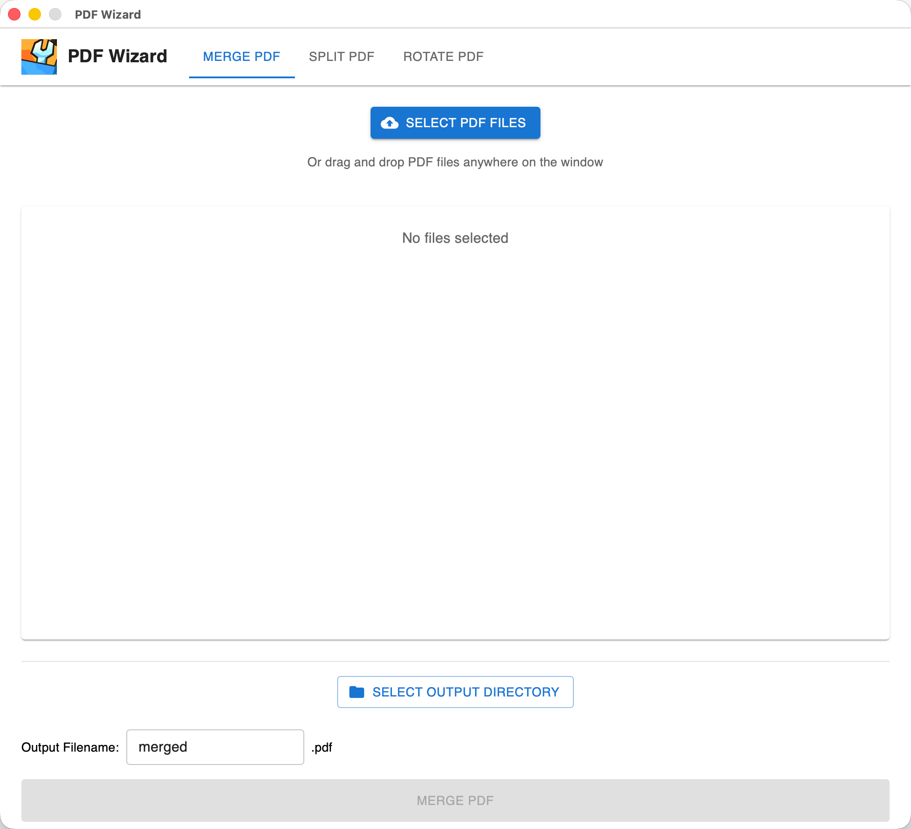
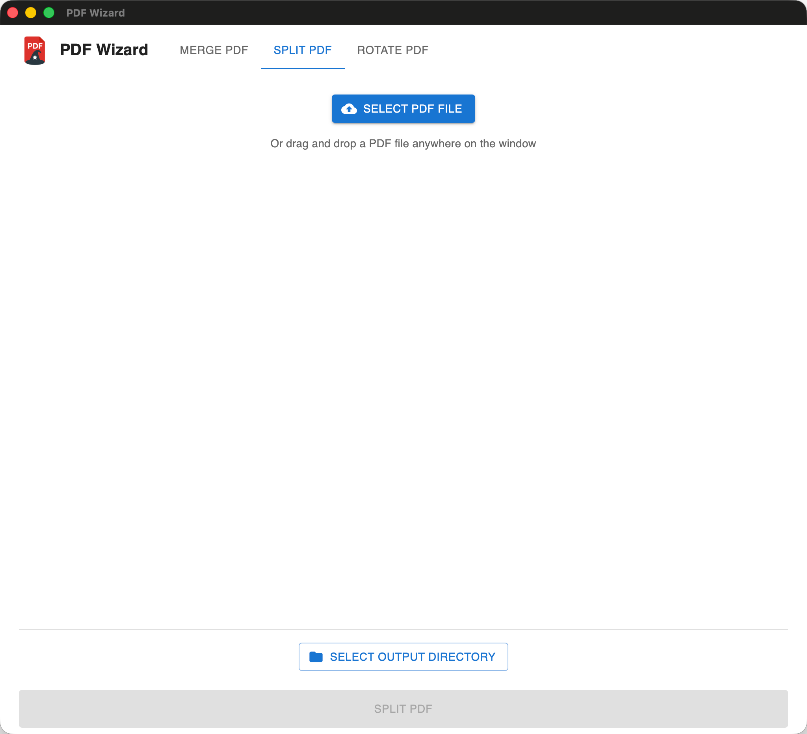
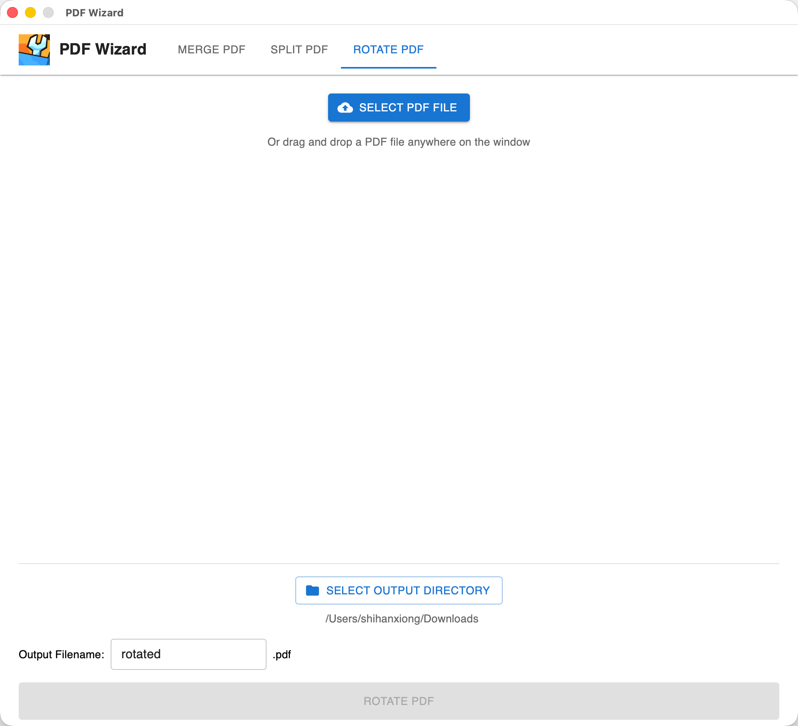

# PDF Wizard

<p align="center">
  
</p>

A modern PDF toolkit built with [Wails v2](https://wails.io), combining Go backend performance with a React/TypeScript frontend. PDF Wizard provides three main features:

- **Merge PDFs**: Combine multiple PDF files into a single document
- **Split PDFs**: Divide a PDF into multiple files based on page ranges
- **Rotate PDFs**: Rotate specific page ranges in a PDF (90°, -90°, or 180°)

## Screenshots

<div align="center">

<style>
.carousel-wrapper {
  max-width: 800px;
  margin: 0 auto;
  position: relative;
}
.carousel-container {
  position: relative;
  overflow: hidden;
  border-radius: 8px;
  box-shadow: 0 4px 6px rgba(0,0,0,0.1);
  background: #fff;
}
.carousel-radio {
  display: none;
}
.carousel-slide {
  display: none;
  width: 100%;
}
.carousel-slide img {
  width: 100%;
  height: auto;
  display: block;
}
.carousel-radio#slide1:checked ~ .carousel-container .slide1,
.carousel-radio#slide2:checked ~ .carousel-container .slide2,
.carousel-radio#slide3:checked ~ .carousel-container .slide3 {
  display: block;
}
.carousel-nav {
  text-align: center;
  padding: 15px 0;
}
.carousel-dot {
  display: inline-block;
  width: 12px;
  height: 12px;
  border-radius: 50%;
  background: #ccc;
  margin: 0 5px;
  cursor: pointer;
  transition: all 0.3s;
}
.carousel-radio#slide1:checked ~ .carousel-nav label[for="slide1"],
.carousel-radio#slide2:checked ~ .carousel-nav label[for="slide2"],
.carousel-radio#slide3:checked ~ .carousel-nav label[for="slide3"] {
  background: #007bff;
  opacity: 1;
}
</style>

<div class="carousel-wrapper">
  <input type="radio" class="carousel-radio" name="carousel" id="slide1" checked>
  <input type="radio" class="carousel-radio" name="carousel" id="slide2">
  <input type="radio" class="carousel-radio" name="carousel" id="slide3">
  
  <div class="carousel-container">
    <div class="carousel-slide slide1">
      
      <p style="text-align: center; margin-top: 10px; font-weight: bold;">Merge PDFs Tab</p>
    </div>
    <div class="carousel-slide slide2">
      
      <p style="text-align: center; margin-top: 10px; font-weight: bold;">Split PDFs Tab</p>
    </div>
    <div class="carousel-slide slide3">
      
      <p style="text-align: center; margin-top: 10px; font-weight: bold;">Rotate PDFs Tab</p>
    </div>
  </div>
  
  <div class="carousel-nav">
    <label for="slide1" class="carousel-dot"></label>
    <label for="slide2" class="carousel-dot"></label>
    <label for="slide3" class="carousel-dot"></label>
  </div>
</div>

</div>

## Downloads

### macOS Installer

Pre-built installers are available in the [`pdf_wizard/dist/`](https://github.com/shihanxiong/PDF_Wizard/tree/master/pdf_wizard/dist) folder:

- **DMG Installer**: [`pdf_wizard-macos-universal.dmg`](https://github.com/shihanxiong/PDF_Wizard/raw/master/pdf_wizard/dist/pdf_wizard-macos-universal.dmg) - Universal binary for both Intel and Apple Silicon Macs
- **ZIP Archive**: [`pdf_wizard-macos-universal.zip`](https://github.com/shihanxiong/PDF_Wizard/raw/master/pdf_wizard/dist/pdf_wizard-macos-universal.zip) - ZIP file containing the application bundle

**Installation Instructions:**

**DMG Installation (Recommended):**

1. Download the DMG file from the [dist folder](https://github.com/shihanxiong/PDF_Wizard/tree/master/pdf_wizard/dist)
2. Double-click the DMG file to mount it
3. Drag `pdf_wizard.app` to the Applications folder (shown in the DMG window)
4. Open Applications folder and launch PDF Wizard
5. On first launch: Right-click → Open → Click "Open" to bypass macOS security warning

**ZIP Installation:**

1. Download the ZIP file from the [dist folder](https://github.com/shihanxiong/PDF_Wizard/tree/master/pdf_wizard/dist)
2. Extract the ZIP file
3. Right-click `pdf_wizard.app` → Open → Click "Open"
4. Or run in Terminal: `xattr -cr pdf_wizard.app`

**System Requirements:**

- macOS 10.13 or later
- Works on Intel and Apple Silicon Macs (universal binary)

> **Note**: If you see "App is damaged and can't be opened", right-click the app → Open → Click "Open", or run `xattr -cr pdf_wizard.app` in Terminal.

## Prerequisites

- Go 1.21 or higher
- Node.js 20+ and npm (Vite 7 requires Node.js 20.19+ or 22.12+)
- Wails CLI v2.8.1 or higher

## Quick Start

### Automated Installation

Run the installation script to set up all dependencies:

```bash
./install.sh
```

This script will:

- Check and install Go (if needed)
- Install Wails CLI
- Verify Node.js and npm are available
- Install frontend dependencies

### Manual Installation

If you prefer to install dependencies manually:

1. **Install Go**: Follow the [official Go installation guide](https://go.dev/doc/install)

2. **Install Wails CLI**:

   ```bash
   go install github.com/wailsapp/wails/v2/cmd/wails@latest
   ```

3. **Verify Node.js**: Ensure Node.js 20+ is installed:
   ```bash
   node --version
   npm --version
   ```

## Development

### Running the Application

```bash
cd pdf_wizard
wails dev
```

This will start the development server with hot-reload enabled for both the frontend and backend.

## Building

### Build Executables

Build platform-specific executables:

```bash
cd pdf_wizard
wails build
```

The output will be generated in the `pdf_wizard/build/bin` directory.

**Build for macOS Distribution:**

To create a universal binary that works on both Intel and Apple Silicon Macs:

```bash
cd pdf_wizard
wails build -platform darwin/universal
```

For distribution to other Mac machines, see [Distribution Guide](pdf_wizard/DISTRIBUTION.md).

**Quick Distribution Build:**

Use the automated build script:

```bash
cd pdf_wizard
./build-dist.sh
```

This creates a ZIP file and DMG ready for distribution in the `pdf_wizard/dist` directory.

## Testing

PDF Wizard includes both backend integration tests and frontend E2E tests.

### Backend Integration Tests

Run the Go integration tests locally:

```bash
cd pdf_wizard
go test -v ./...
```

This will run all tests with verbose output.

**Test Coverage:**

To see test coverage:

```bash
cd pdf_wizard
go test -v -coverprofile=coverage.out ./...
go tool cover -func=coverage.out
```

To view an HTML coverage report:

```bash
go tool cover -html=coverage.out
```

**Run Specific Tests:**

Run a specific test function:

```bash
cd pdf_wizard
go test -v -run TestGetFileMetadata
```

Run tests with race detection:

```bash
cd pdf_wizard
go test -v -race ./...
```

### Frontend E2E Tests

The frontend uses Playwright for end-to-end UI testing. These tests verify the application UI, user interactions, and component behavior.

**Running E2E Tests:**

Run all E2E tests:

```bash
cd pdf_wizard/frontend
npm run test:e2e
```

This will:

1. Automatically start the Vite dev server
2. Run all E2E tests in Chromium
3. Generate HTML reports and screenshots on failure

**Interactive Test Modes:**

- **UI Mode** (recommended for development): Watch tests run step-by-step in a visual UI

  ```bash
  npm run test:e2e:ui
  ```

- **Headed Mode**: Run tests with a visible browser window

  ```bash
  npm run test:e2e:headed
  ```

- **Debug Mode**: Step through tests with Playwright Inspector
  ```bash
  npm run test:e2e:debug
  ```

**Viewing Test Reports:**

After running tests, view the HTML report:

```bash
cd pdf_wizard/frontend
npx playwright show-report
```

**E2E Test Coverage:**

The E2E test suite includes:

- App loading and initialization
- Tab navigation (Merge/Split/Rotate tabs)
- UI component visibility and functionality
- User interactions (form inputs, buttons)
- State management
- Material-UI component rendering

For more details, see the [E2E Testing README](pdf_wizard/frontend/e2e/README.md).

## Project Structure

```
PDF_Wizard/
├── pdf_wizard/          # Main Wails application
│   ├── frontend/        # React/TypeScript frontend
│   │   ├── e2e/         # Playwright E2E tests
│   │   ├── src/         # React source code
│   │   └── dist/        # Built frontend assets
│   ├── services/        # Go service layer
│   ├── models/          # Data models
│   ├── app.go           # Go application entry
│   └── main.go          # Wails main file
├── assets/              # Application assets
└── .github/workflows/   # GitHub Actions CI/CD workflows
```

## Troubleshooting

### `wails` command not found

**macOS/Linux:**

Ensure Go is properly installed and your `GOPATH/bin` is in your `PATH`. You can add it to your shell profile:

```bash
export PATH=$PATH:$(go env GOPATH)/bin
```

If you prefer to copy the binary to a system path:

```bash
sudo cp ~/go/bin/wails /usr/local/go/bin/
```

**Windows:**

Add `%USERPROFILE%\go\bin` to your system PATH environment variable.

### Node.js not found

Install Node.js from [nodejs.org](https://nodejs.org/) or use a version manager like [nvm](https://github.com/nvm-sh/nvm).

### Frontend dependencies not installing

Navigate to the frontend directory and install manually:

```bash
cd pdf_wizard/frontend
npm install
```

## Contributing

Contributions are welcome! Please feel free to submit a Pull Request.

## License

[Add your license here]
