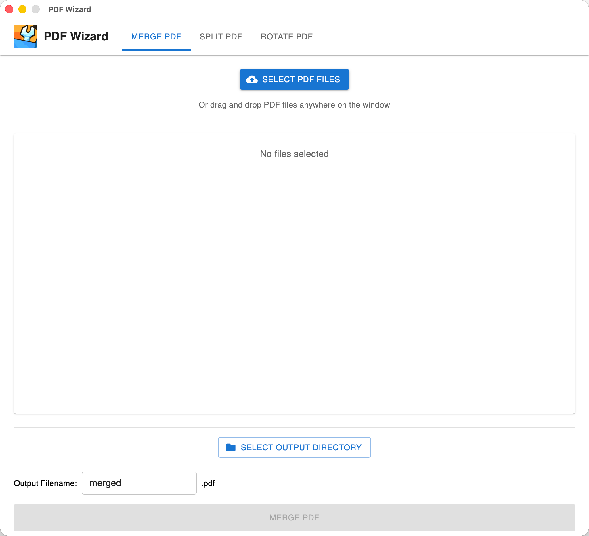
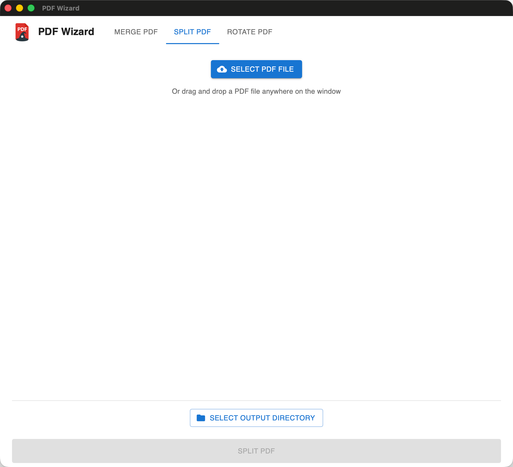
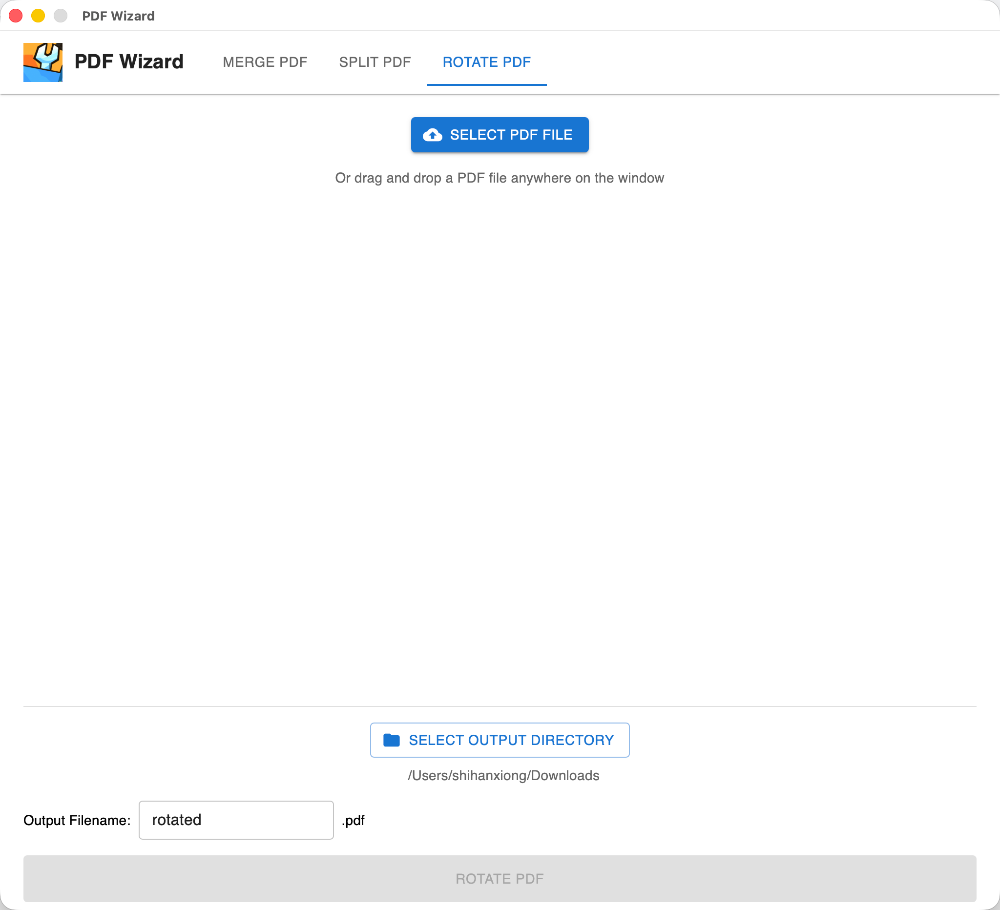
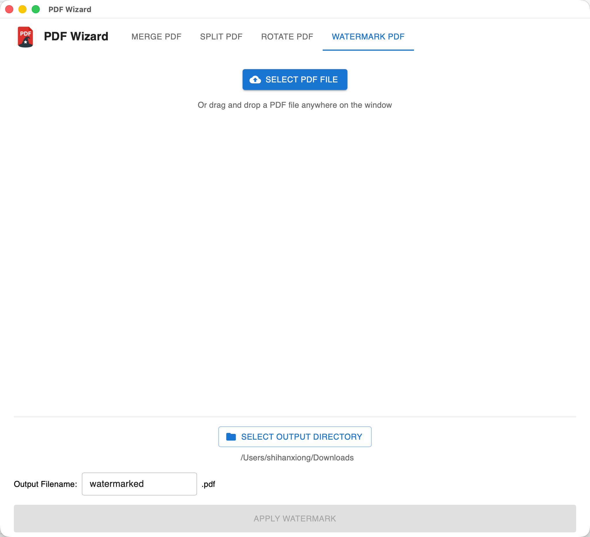
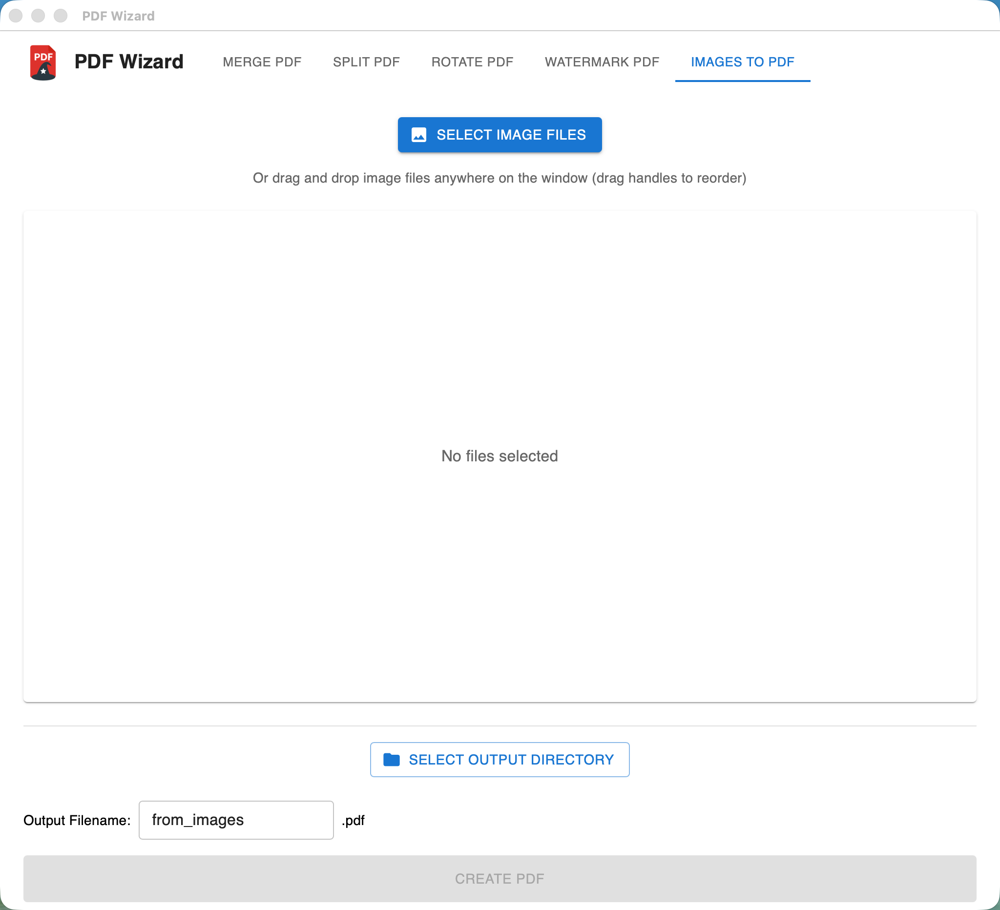

# PDF Wizard

<p align="center">
  
</p>

A modern PDF toolkit built with [Wails v2](https://wails.io), combining Go backend performance with a React/TypeScript frontend. PDF Wizard provides seven main features:

- **Merge PDFs**: Combine multiple PDF files into a single document
- **Split PDFs**: Divide a PDF into multiple files based on page ranges
- **Rotate PDFs**: Rotate specific page ranges in a PDF (90°, -90°, or 180°)
- **Watermark PDFs**: Add text watermarks to PDFs with customizable font, size, color, opacity, rotation, and position. Features **language-specific fonts** that automatically adapt based on your selected language (Chinese, Japanese, Korean, Hindi, and standard fonts for other languages)
- **Images to PDF**: Build one PDF from multiple images (JPEG, PNG, WebP, TIFF, GIF, BMP, HEIC/HEIF) with drag-and-drop reorder; **receive from phone** on the same Wi‑Fi via a LAN upload page and QR code (localized HTML, session limits, automatic stop after upload). HEIC/HEIF are converted to temporary JPEGs before import for reliable, faster processing
- **PDF to Text**: Extract plain text from a PDF into an editable area, with copy and select-all; unencrypted PDFs only (unlock first if protected); image-only or scanned pages may return little or no text (no OCR)
- **Lock / Unlock PDF**: Encrypt a PDF with a password or decrypt a protected PDF to a new file

**Features:**

- 🌍 **Internationalization**: Supports 12 languages (English, Chinese Simplified, Chinese Traditional, Arabic, French, Japanese, Hindi, Spanish, Portuguese, Russian, Korean, German) with easy language switching
- 🎨 **Modern UI**: Built with Material-UI for a polished, responsive interface
- 🖱️ **Drag & Drop**: Intuitive file handling with drag-and-drop support
- ⚡ **Fast Performance**: Native Go backend ensures quick PDF processing

## Screenshots

### Merge PDF Tab

<p align="center">
  
</p>

### Split PDF Tab

<p align="center">
  
</p>

### Rotate PDF Tab

<p align="center">
  
</p>

### Watermark PDF Tab

<p align="center">
  
</p>

### Images to PDF Tab

<p align="center">
  
</p>

## Downloads

Pre-built installers are available in the [`pdf_wizard/dist/`](https://github.com/shihanxiong/PDF_Wizard/tree/master/pdf_wizard/dist) folder.

### macOS

- **DMG Installer**: [`pdf_wizard-macos-universal.dmg`](https://github.com/shihanxiong/PDF_Wizard/raw/master/pdf_wizard/dist/pdf_wizard-macos-universal.dmg) - Universal binary for both Intel and Apple Silicon Macs
- **ZIP Archive**: [`pdf_wizard-macos-universal.zip`](https://github.com/shihanxiong/PDF_Wizard/raw/master/pdf_wizard/dist/pdf_wizard-macos-universal.zip) - ZIP file containing the application bundle

**macOS Installation Instructions:**

**DMG Installation (Recommended):**

1. Download the DMG file from the [dist folder](https://github.com/shihanxiong/PDF_Wizard/tree/master/pdf_wizard/dist)
2. Double-click the DMG file to mount it
3. Drag `PDF Wizard.app` to the Applications folder (shown in the DMG window)
4. Open Applications folder and launch PDF Wizard
5. On first launch: Right-click → Open → Click "Open" to bypass macOS security warning

**ZIP Installation:**

1. Download the ZIP file from the [dist folder](https://github.com/shihanxiong/PDF_Wizard/tree/master/pdf_wizard/dist)
2. Extract the ZIP file
3. Right-click `PDF Wizard.app` → Open → Click "Open"
4. Or run in Terminal: `/usr/bin/xattr -cr "PDF Wizard.app"`

**macOS System Requirements:**

- macOS 10.13 or later
- Works on Intel and Apple Silicon Macs (universal binary)

> **Note**: If you see "App is damaged and can't be opened", right-click the app → Open → Click "Open", or run `/usr/bin/xattr -cr "PDF Wizard.app"` in Terminal.

### Windows

- **Standalone Executable**: [`pdf_wizard-windows.exe`](https://github.com/shihanxiong/PDF_Wizard/raw/master/pdf_wizard/dist/pdf_wizard-windows.exe) - Portable executable, no installation required
- **Installer** (optional): [`pdf_wizard-windows-installer.exe`](https://github.com/shihanxiong/PDF_Wizard/raw/master/pdf_wizard/dist/pdf_wizard-windows-installer.exe) - NSIS installer for easy installation (only created if NSIS is installed)
- **Portable ZIP**: [`pdf_wizard-windows-portable.zip`](https://github.com/shihanxiong/PDF_Wizard/raw/master/pdf_wizard/dist/pdf_wizard-windows-portable.zip) - ZIP archive containing the executable

**Windows Installation Instructions:**

**Standalone Executable (Recommended for Quick Start):**

1. Download `pdf_wizard-windows.exe` from the [dist folder](https://github.com/shihanxiong/PDF_Wizard/tree/master/pdf_wizard/dist)
2. Double-click `pdf_wizard-windows.exe` to run
3. No installation required - it's portable!

**Installer** (optional, requires NSIS to be installed during build):

1. Download the installer from the [dist folder](https://github.com/shihanxiong/PDF_Wizard/tree/master/pdf_wizard/dist)
2. Double-click `pdf_wizard-windows-installer.exe`
3. Follow the installation wizard
4. Launch PDF Wizard from the Start menu or desktop shortcut

> **Note**: The installer is only created if NSIS (Nullsoft Scriptable Installer System) is installed on the build machine. If you don't see this file, use the standalone executable or ZIP archive instead.

**Portable ZIP:**

1. Download the ZIP file from the [dist folder](https://github.com/shihanxiong/PDF_Wizard/tree/master/pdf_wizard/dist)
2. Extract the ZIP file to a folder of your choice
3. Double-click `PDF Wizard.exe` to run
4. No installation required - it's portable!

**Windows System Requirements:**

- Windows 10 or later
- Works on both 32-bit and 64-bit Windows

> **Note**: If Windows Defender or SmartScreen blocks the app, click "More info" → "Run anyway". The app is safe - it's just not code-signed.

## Prerequisites

- **Go 1.25** (specified in `pdf_wizard/go.mod`)
- **Node.js 22.21.1** (required by the project)
- **Wails CLI v2.12.0** (matches `github.com/wailsapp/wails/v2 v2.12.0` in `pdf_wizard/go.mod`)

## Documentation

Long-form material lives in dedicated files so it is not copied in multiple places:

| Topic                                               | Document                                                                                     |
| --------------------------------------------------- | -------------------------------------------------------------------------------------------- |
| Architecture, UI patterns, watermark & images-to-PDF | [SYSTEM_DESIGN.md](SYSTEM_DESIGN.md) (includes a **documentation map**)                      |
| Release packaging (DMG, ZIP, `build-dist.sh`, NSIS) | [pdf_wizard/DISTRIBUTION.md](pdf_wizard/DISTRIBUTION.md)                                     |
| `main.go`, `app.go`, menu, config file, models      | [pdf_wizard/DESIGN.md](pdf_wizard/DESIGN.md)                                                 |
| Tab components and Settings UI                      | [pdf_wizard/frontend/src/components/DESIGN.md](pdf_wizard/frontend/src/components/DESIGN.md) |
| Go services (merge, split, rotate, watermark, images→PDF, **LAN phone upload**) | [pdf_wizard/services/DESIGN.md](pdf_wizard/services/DESIGN.md)                         |
| i18n files, `useI18n`, adding a language            | [pdf_wizard/frontend/src/utils/i18n/DESIGN.md](pdf_wizard/frontend/src/utils/i18n/DESIGN.md) |
| Daily commands from `pdf_wizard/`                   | [pdf_wizard/README.md](pdf_wizard/README.md)                                                 |

## Quick Start

### Automated Installation

Run the installation script to set up all dependencies:

```bash
./install.sh
```

This script will:

- Check and install Go (if needed)
- Install Wails CLI
- Verify Node.js and npm are available
- Install frontend dependencies

### Manual Installation

If you prefer to install dependencies manually:

1. **Install Go**: Follow the [official Go installation guide](https://go.dev/doc/install)

2. **Install Wails CLI**:

   ```bash
   go install github.com/wailsapp/wails/v2/cmd/wails@latest
   ```

3. **Verify Node.js**: Ensure Node.js 22.21.1 is installed:
   ```bash
   node --version  # Should show v22.21.1
   npm --version
   ```

## Development

For development instructions, see [pdf_wizard/README.md](pdf_wizard/README.md).

## Building

From `pdf_wizard/`, run `wails build` (output under `pdf_wizard/build/bin/`; that tree is gitignored except the tracked **`pdf_wizard/build/appicon.png`**). Committed release packages live under **`pdf_wizard/dist/`** only. Universal macOS builds, `build-dist.sh` / `build-dist.ps1`, DMG/ZIP/Windows artifacts, and NSIS notes are documented only in **[pdf_wizard/DISTRIBUTION.md](pdf_wizard/DISTRIBUTION.md)**.

## Testing

```bash
cd pdf_wizard && go test -v ./...
```

```bash
cd pdf_wizard/frontend && npm run test:e2e
```

Coverage reports, filtering tests by name, and Playwright/CI details: **[pdf_wizard/frontend/e2e/README.md](pdf_wizard/frontend/e2e/README.md)** and **[SYSTEM_DESIGN.md § Testing](SYSTEM_DESIGN.md#testing)**.

## Features

- **Watermark PDFs** (language-aware fonts, positions, opacity): [SYSTEM_DESIGN.md — Watermark PDF Tab](SYSTEM_DESIGN.md#watermark-pdf-tab).
- **Images to PDF — phone upload** (QR, LAN server, session rules): [SYSTEM_DESIGN.md — Images to PDF Tab](SYSTEM_DESIGN.md#images-to-pdf-tab) and [pdf_wizard/services/DESIGN.md — LAN phone image upload](pdf_wizard/services/DESIGN.md#lan-phone-image-upload).
- **PDF to Text** (extraction, limitations): [SYSTEM_DESIGN.md — PDF to Text Tab](SYSTEM_DESIGN.md#pdf-to-text-tab) and [pdf_wizard/services/DESIGN.md — ExtractPDFText](pdf_wizard/services/DESIGN.md#extractpdftext-pdf-to-text-tab).
- **Internationalization** (12 languages, `useI18n`, adding a locale): [pdf_wizard/frontend/src/utils/i18n/DESIGN.md](pdf_wizard/frontend/src/utils/i18n/DESIGN.md).

## Technology stack

Stack versions and dependencies (Go modules, React, MUI, pdfcpu, Playwright, etc.) are listed in **[SYSTEM_DESIGN.md § Technology stack](SYSTEM_DESIGN.md#technology-stack)** and **[§ Technical considerations](SYSTEM_DESIGN.md#technical-considerations)**.

## Repository layout

High-level tree and the role of each major folder: **[SYSTEM_DESIGN.md § Project Structure](SYSTEM_DESIGN.md#project-structure)**.

## Configuration

### Language Settings

PDF Wizard stores your language preference in a configuration file:

- **macOS**: `~/Library/Application Support/PDF Wizard/pdf_wizard_config.json`
- **Windows**: `%AppData%\PDF Wizard\pdf_wizard_config.json`
- **Linux**: `~/.config/PDF Wizard/pdf_wizard_config.json`

The config file is automatically created when you change the language. You can also manually edit it:

```json
{
  "language": "en"
}
```

Valid `"language"` values are exactly the codes in **`pdf_wizard/i18n/supported-languages.json`**, which generates frontend `SUPPORTED_LANGUAGES` and Go `validLanguages` via **`scripts/generate-supported-languages.sh`**. See [pdf_wizard/DESIGN.md](pdf_wizard/DESIGN.md) and [pdf_wizard/frontend/src/utils/i18n/DESIGN.md](pdf_wizard/frontend/src/utils/i18n/DESIGN.md).

## Troubleshooting

### `wails` command not found

**macOS/Linux:**

Ensure Go is properly installed and your `GOPATH/bin` is in your `PATH`. You can add it to your shell profile:

```bash
export PATH=$PATH:$(go env GOPATH)/bin
```

If you prefer to copy the binary to a system path:

```bash
sudo cp ~/go/bin/wails /usr/local/go/bin/
```

**Windows:**

Add `%USERPROFILE%\go\bin` to your system PATH environment variable.

### Node.js not found

Install Node.js from [nodejs.org](https://nodejs.org/) or use a version manager like [nvm](https://github.com/nvm-sh/nvm).

### Frontend dependencies not installing

Navigate to the frontend directory and install manually:

```bash
cd pdf_wizard/frontend
npm install
```

### macOS: app blocked or “unidentified developer” after sharing the DMG

How you copy the app (AirDrop, WeChat, USB, etc.) does **not** change Gatekeeper rules. Unsigned or unnotarized builds still need **Right-click → Open** (or **Privacy & Security**) the first time. For fewer prompts for end users, use **signed and notarized** builds; see [pdf_wizard/DISTRIBUTION.md](pdf_wizard/DISTRIBUTION.md).

### Language not changing

If the language doesn't update after changing it in Settings:

1. Check that the config file was created in the correct location (see [Configuration](#configuration))
2. Restart the application
3. Verify the config file contains valid JSON with a `"language"` field set to one of the supported language codes (see [Configuration](#configuration) for valid values)

## Contributing

Contributions are welcome! Please feel free to submit a Pull Request.

## License

[Add your license here]
