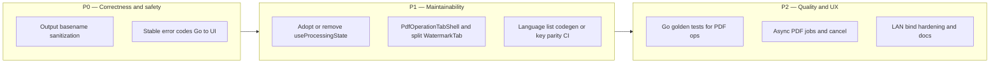

# PDF Wizard — Improvement backlog

Staff-level review of the codebase (architecture, reliability, security, testing, and maintainability). Use this as a living backlog; tactical items already tracked in [pdf_wizard/OPTIMIZATION_REPORT.md](pdf_wizard/OPTIMIZATION_REPORT.md) are referenced where they overlap.

**Last reviewed:** 2026-05-19

---

## What’s working well

| Area | Observation |
| --- | --- |
| **Architecture** | Thin Wails binding in `app.go`, business logic in `services/`, shared validation in `validation.go` — easy to reason about. |
| **Documentation** | [SYSTEM_DESIGN.md](SYSTEM_DESIGN.md) plus per-area `DESIGN.md` files and a documentation map reduce tribal knowledge. |
| **Performance** | Merge avoids double-read on success; split uses one read plus per-segment extract; HEIC → temp JPEG before import. |
| **Testing (Go)** | `go test ./...` passes; ~60% statement coverage in `services/`, meaningful tests in `pdf_service_test.go`. |
| **CI** | Integration tests, Playwright e2e, and macOS + Windows Wails builds on PRs. |
| **UX foundations** | App-level drag/drop with stable tab ids, lazy tab bundles, shared hooks (`usePDFDrop`, `useOutputDirectory`). |

---

## Priority roadmap

**Suggested first PRs:** (1) output basename validation + typed PDF errors; (2) adopt `useProcessingState` and extract a shared single-PDF tab shell.

---

## 1. High impact — reliability and correctness

### Structured errors instead of string matching

Backend merge failures special-case pdfcpu messages via substring checks in `services/pdf_service.go` (`validateFontEncoding`, `Encoding`). The Lock/Unlock tab infers mode from `password` / `encrypt` in error text (`LockUnlockTab.tsx`). That breaks when pdfcpu changes wording or errors are wrapped differently.

**Recommendation:** Introduce stable error kinds in Go (e.g. `var ErrPasswordRequired = errors.New("...")` or `PDFError{Code: "password_required"}`) and map them once at the Wails boundary. The frontend should branch on **codes**, not English substrings.

**Related:** [pdf_wizard/OPTIMIZATION_REPORT.md](pdf_wizard/OPTIMIZATION_REPORT.md) — Go error style consistency (low priority).

### Output path hardening

`outputPath := filepath.Join(outputDirectory, outputFilename+PDFExtension)` is used throughout `pdf_service.go` without ensuring `outputFilename` is a single safe basename (no `/`, `\`, or `..`). `filepath.Join` and `Clean` can still resolve outside the chosen output directory.

**Recommendation:** Add a shared `sanitizeOutputBasename(name string) (string, error)` and use it on every write path; reject path separators and `..`.

### Long-running work blocks the UI

PDF work runs synchronously from Wails calls. There is no cancellation, progress reporting, or background job pattern. Large merges and watermarks freeze the webview until completion.

**Recommendation:** For operations that can exceed ~1–2 seconds, run work in a goroutine with `context.Context`, expose **Cancel** and optional **Progress** via Wails events, and prevent duplicate submits on the frontend.

---

## 2. High impact — frontend maintainability

### Tab components duplicate structure

`SplitTab`, `RotateTab`, `WatermarkTab`, and similar tabs each reimplement local `isProcessing` / `error` / `success`, the select-PDF → metadata → output directory → submit flow, and loading buttons.

Shared hooks exist (`usePDFDrop`, `useOutputDirectory`, `useErrorHandler`), but **`useProcessingState` is defined and never used by any tab** — either adopt it everywhere or remove it to avoid confusion.

**Recommendation (phased):**

1. Wire all tabs through `useProcessingState` and `useErrorHandler` consistently.
2. Extract a **`PdfOperationTabShell`** (file picker, `PDFInfoCard`, `OutputDirectorySelector`, `FilenameInput`, alerts, primary action) for single-PDF tabs.
3. Split **`WatermarkTab`** (~650+ lines) into subcomponents (preview, text config, page range).

**Related:** [pdf_wizard/OPTIMIZATION_REPORT.md](pdf_wizard/OPTIMIZATION_REPORT.md) — shared tab UI logic (partial).

### Duplicate language bootstrap

`App.tsx` and `SettingsDialog.tsx` both load and validate language on startup/open.

**Recommendation:** Single `usePersistedLanguage()` hook owning `GetLanguage`, `SetLanguage`, and `setLanguage`.

### TypeScript error handling consistency

Several files still use bare `catch (err)` instead of `catch (err: unknown)` plus `getErrorMessage()` (`App.tsx`, `SettingsDialog.tsx`, parts of `ImagesToPdfTab.tsx`).

**Recommendation:** Enable `useUnknownInCatchVariables` in `tsconfig.json` and finish the migration (#61 in optimization report).

---

## 3. Security and privacy (desktop-appropriate)

### LAN phone upload (`services/phone_upload.go`)

Reasonable for trusted LAN use (random token, session limits, stop after upload). Hardening opportunities:

| Risk | Detail |
| --- | --- |
| **Bind scope** | Listens on `0.0.0.0:0` — reachable on all interfaces, not only the LAN IP in the QR URL. |
| **Cleartext HTTP** | Expected on LAN; other devices on the network can observe uploads. |
| **Token in URL** | Referrers or logs may retain `/u/{token}/`. |
| **Auth model** | Anyone with the URL during the session window can POST (mitigated by short session and auto-stop). |

**Recommendations:** Prefer binding to the selected LAN IP where possible; document firewall expectations; consider ephemeral HTTPS later if stronger LAN guarantees are needed.

### Passwords

Passwords live in React state and cross Wails as plain strings until cleared. Acceptable for a local app; avoid logging errors that echo sensitive context; document in threat model.

---

## 4. Testing and quality gates

### E2e tests do not exercise real PDF operations

`frontend/e2e/helpers/test-setup.ts` mocks `MergePDFs`, `SplitPDF`, `ApplyWatermark`, etc. as no-ops. E2e coverage is navigation, i18n, and UI wiring — valuable, but it will not catch pdfcpu regressions.

| Layer | Gap | Suggestion |
| --- | --- | --- |
| **Go** | `models/` has no tests; `main` package ~40% coverage | Golden-file tests per operation with fixtures under `testdata/` |
| **Frontend** | No unit tests; only Playwright | Vitest for `formatters`, i18n `catalog` key parity, shared helpers |
| **E2e** | PDF ops mocked | Optional nightly job with real Wails bindings and fixture PDFs |

### CI coverage not enforced

The integration workflow prints coverage but does not fail on regression or upload to a dashboard.

**Recommendation:** Fail PRs if `services` coverage drops below the current baseline (~62%), or upload to Codecov.

---

## 5. Internationalization at scale

Supported languages are maintained in three places (see [pdf_wizard/frontend/src/utils/i18n/DESIGN.md](pdf_wizard/frontend/src/utils/i18n/DESIGN.md)):

- Twelve locale modules under `frontend/src/utils/i18n/`
- `frontend/src/utils/i18n/constants.ts` (`SUPPORTED_LANGUAGES`)
- `pdf_wizard/app.go` (`validLanguages`)

Adding a locale is a manual multi-file change; drift is likely.

**Recommendations (when adding locale #13+):**

- **Codegen:** `supported-languages.json` → Go map + TS constants + `Language` union.
- **Or** JSON/PO at build time with TS types only.
- **CI:** Key-diff script ensuring every locale matches `en.ts`.

---

## 6. Operations and release engineering

### Two distribution stories

- **Repo:** `pdf_wizard/dist/` holds committed release binaries (per [pr-conventions](.cursor/rules/pr-conventions.mdc)).
- **CI:** [.github/workflows/pdf_wizard_wails_build.yml](.github/workflows/pdf_wizard_wails_build.yml) builds artifacts attached to workflow runs without committing them.

Longer term, consider GitHub Releases–only binaries to avoid git bloat and duplicate pipelines.

### Version source of truth

`main.go` About box lists **Version 1.0.3**; `frontend/package.json` is **0.0.0**.

**Recommendation:** Single version file embedded at build time (e.g. `version.txt` or ldflags).

---

## 7. Product and platform gaps (strategic)

Documented limitations — track as roadmap, not refactors:

| Gap | Note |
| --- | --- |
| **No OCR** | PDF-to-text is extraction only; scanned PDFs may return little text. |
| **Linux** | README targets macOS and Windows; Wails can support Linux if desired. |
| **Accessibility** | Complex tabs (DnD, watermark controls) may need dedicated a11y passes. |
| **Very large files** | Desktop merge remains memory-bound via pdfcpu; no streaming UX. |

---

## 8. Quick wins (from OPTIMIZATION_REPORT.md)

Already captured in [pdf_wizard/OPTIMIZATION_REPORT.md](pdf_wizard/OPTIMIZATION_REPORT.md); highest ROI:

| # | Item | Issue / note |
| --- | --- | --- |
| 1 | TypeScript `unknown` in catch + `getErrorMessage` | #61 |
| 2 | `GetFileMetadata` vs `GetPDFMetadata` — unify stat path | #54 (partial; `statPDFFile` exists) |
| 3 | `removeIfExists` → `os.Remove` + `errors.Is(ErrNotExist)` | #56 |
| 4 | Page-range parsing: `strconv.Atoi` instead of `Sscanf` | #55 |
| 5 | Go `fmt.Errorf` wrapping consistency | style only |

---

## Completed reference (do not re-open as “new” work)

These were past improvement themes; see OPTIMIZATION_REPORT **Completed work**:

- Centralized validation (`services/validation.go`)
- Shared constants (`services/constants.go`)
- Merge: diagnose only on failure (#53)
- Split: single read + extract per segment (#57)
- Frontend constants and hooks (`usePDFDrop`, `useImageDrop`, etc.)
- LAN phone upload shipped (`phone_upload.go`)

---

## How to use this document

1. Pick a **priority band** (P0 → P2) or a **theme** (security, testing, i18n).
2. Open or create a GitHub issue; link back to the section here.
3. When an item ships, move a one-line summary to **Completed reference** or close the issue and trim this file so it stays actionable.
